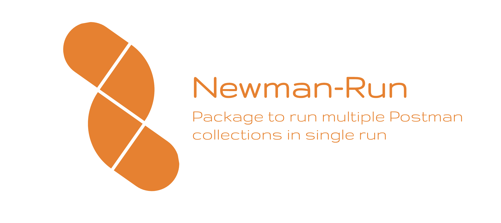

# Newman-Run

A package to run multiple postman collections in single run by leveraging newman library. This will help us to merge and view the results of multiple collections in a single place using allure.

[](LICENSE)
[](https://www.ruby-lang.org/en/)
[]( https://stackoverflow.com/users/10505289/naresh-sekar )
[](CONTRIBUTING.md)
[](mailto:nareshnavinash@gmail.com)





## Prevailing Problem

If we need to run multiple postman collections or single postman collections with multiple environments, then it becomes we need to have multiple command lines as,

```
newman run <file1.json>
newman run <file2.json> -e <env1.json>
newman run <file2.json> -e <env2.json>
...
```

Also, if we need to have multiple reports along with this run, we need to specify those each of these command line run along with the folder in which the reports should be generated as,

```
newman run <file1.json> --reporters cli,html,allure --reporter-html-export htmlOutput.html --reporter-allure-export <allure-results-out-dir>
newman run <file2.json> -e <env1.json> --reporters cli,html,allure --reporter-html-export htmlOutput.html --reporter-allure-export <allure-results-out-dir>
newman run <file2.json> -e <env2.json> --reporters cli,html,allure --reporter-html-export htmlOutput.html --reporter-allure-export <allure-results-out-dir>

```

So, as we can see the params that we are passing in the commandline keeps on increasing and its much difficult to consolidate and have a single report for multiple newman run. In Python or in Ruby test runs we have profiles that we can specify during a run which will have most of the static commandline params. 

Also to run different collections at the same time, we need to depend on the shell's default multi run with `&&` between multiple newman runs. Here, if we are running three newman runs as,

```
newman run <file1.json> && newman run <file2.json> && newman run <file3.json>
```

and if the `file2.json` takes long time to run than other two, then if we have any failures in `<file1.json>` or `<file2.json>` that will not be shown in the jenkins jobs or any CI tools such as bitbucket pipeline. This happens because the result of the run which completes at last takes precedence over others.


## Aim

This package is aimed at resolving the above particular issue along with allure reports integration which can be easily integrated with jenkins. This allows us to run multiple collections defined in a single json file and run all the collections in one shot and have a combined reports at allure.


## Supports
* Multiple collections run in single shot
* Allure reports along with newman's default CLI, HTML, HTMLEXTRA & JSON
* Jenkins Integration
* Docker Execution
* Cross-platform (Windows, macOS, Linux)


## Pending
* (Currently no pending features)


## Installation

### Prerequisites
* **Node.js >= 16** is required (Newman 6.x requirement)

The easiest way to install Newman-Run is using NPM. If you have Node.js installed, it is most likely that you have NPM installed as well.

```
npm install -g newman-run
```
This installs Newman-Run globally on your system allowing you to run it from anywhere. If you want to install it locally, Just remove the -g flag.

If you want this to be added to your package.json, run with either `--save` or `--save-dev` depending on your usage.


## Usage

To check for the available commandline arguments use `newman-run --help`

### Multi-Collection run

Here we can see our original aim to run multiple collections in single shot.

For a simple run of all the feature files in normal mode, try
```
newman-run -c <Feed_file_path_which_contains_input_collections>
```

Here we are going to use the feed file extensively to make our package run multiple collections at a time. Feed file is nothing but a json file where we need to specify the path of collection and environment JSON's.

#### Feed files

The feed file is the core structure for this package to function. In the feed file, one has to specify the collections and environment json files path or the url in the array format inside `runs` variable like,

```
{
    "runs":[
        {
            "collection": "./collections/test_scripts.postman_collection.json"
        },
        {
            "collection": "./collections/file_upload_collection.postman_collection.json",
            "environment": "./environment/test_environment.json"
        }
        
    ]
}
```

If we have only collections that need to be run as part of the test, then have `collection` alone. If we have collection and environment files, then we need to specify both `collection` and `environment` in json format.

#### Iteration Data (Data-Driven Testing)

You can also specify iteration data files (CSV or JSON) for data-driven testing:

```
{
    "runs":[
        {
            "collection": "./collections/test_scripts.postman_collection.json",
            "iterationData": "./data/test_data.csv"
        },
        {
            "collection": "./collections/api_tests.postman_collection.json",
            "environment": "./environment/test_environment.json",
            "iterationData": "./data/api_data.json"
        }
    ]
}
```

For single collection runs, you can use the `-d` flag:
```
newman-run -c ./collection/test.json -d ./data/test_data.csv
```

When we initiate the tests, the `runs` array will be iterated and all the tests will be run using `newman` package. 

Ideally we should have the postman collection link as the feed file input, this gives us the leverage of modifying the tests via postman without touching the core framework. The ideal feed file will be,

```
{
    "runs":[
        {
            "collection": "https://www.getpostman.com/collections/57c3cfef239jeijw39d93"
        },
        {
            "collection": "https://www.getpostman.com/collections/57c3cfef239jeijwew282",
            "environment": "./environment/test_environment.json"
        },
        {
            "collection": "https://www.getpostman.com/collections/57c3cfef239jeijwew282",
            "environment": "./environment/dev_environment.json"
        },
        {
            "collection": "https://www.getpostman.com/collections/57c3cfef239jeijwew282",
            "environment": "./environment/prod_environment.json"
        }
    ]
}
```

Once the feed file is prepared, one can directly trigger the test by,

```
newman-run -f <Feed_file_which_contains_input_collections>
```

Now as you can see, you can specify N number of environment combinations with the same collection file or different collection file. All these will run in one shot and we can have a collated result view in the allure.

#### A/Synchronous mode

By default, the collections are executed asynchronously (in parallel). By specifying the '-s' or '--synchronous' option, the system will execute all collections in order, one at a time.

```
newman-run -s -f <./feed/<feed_file.json>
```

#### Parallel Execution with Concurrency Control

You can control how many collections run in parallel using the `-p` or `--parallel` option. This is useful when you want to limit resource usage or avoid overwhelming an API:

```
# Run maximum 3 collections at a time
newman-run -f <./feed/<feed_file.json> -p 3

# Run 2 collections at a time
newman-run -f <./feed/<feed_file.json> --parallel 2
```

By default (`-p 0`), all collections run in parallel with no limit. Using `-s` for synchronous mode is equivalent to `-p 1`.

### To achieve basic newman functionality along with reports

To support the basic `newman` functionality, the `newman-run` command allows you to specify a collection to be run. You can easily export your Postman Collection as a json file from the Postman App and run it using Newman.

```
newman-run -c <./collection/<example_collection.json>
```

If you have environment file to be passed, you can conviniently do the same.

```
newman-run -c <./collection/<example_collection.json> -e <./environment/<example_env.json>
```

You can also specifiy both the feed file as well as collections at the same time.

```
newman-run -f <./feed/<feed_file.json> -c <./collection/<example_collection.json>
```

This allows us to run any collection dynamically along with our set of collections.

The above will take care the reporting part and we don't need to mention about that from the command line. Along with allure reports, newman's default CLI, HTML, HTMLEXTRA and JSON reports are added which can be found at `reports/` path. For sophesticated classification, reports for each collection is isolated with different name. If needed JSON and HTML files can be pushed to S3 for further processing or to have a record.
You can configure the list of reporters to use:

```
newman-run -f <./feed/<feed_file.json> -R cli html htmlextra json allure
```

### Advanced Newman Options

Newman-run supports several advanced options that can be passed via CLI or feed file:

#### Global Variables
```
newman-run -c ./collection/test.json -g ./globals/global_vars.json
```

#### Timeouts
```
# Set request timeout to 30 seconds
newman-run -c ./collection/test.json --timeout-request 30000

# Set script timeout to 10 seconds
newman-run -c ./collection/test.json --timeout-script 10000

# Set global timeout for entire run
newman-run -c ./collection/test.json --timeout 300000
```

#### Bail on First Failure
Stop execution on the first test failure:
```
newman-run -f ./feed/feed.json --bail
```

#### Delay Between Requests
Add a delay (in ms) between requests:
```
newman-run -c ./collection/test.json --delay-request 500
```

#### Run Specific Folder
Run only a specific folder from the collection:
```
newman-run -c ./collection/test.json --folder "User API Tests"
```

#### Feed File Options
All these options can also be specified per-run in the feed file:
```
{
    "runs":[
        {
            "collection": "./collections/test.json",
            "environment": "./environment/test.json",
            "globals": "./globals/global_vars.json",
            "timeout": 300000,
            "timeoutRequest": 30000,
            "bail": true,
            "folder": "Smoke Tests"
        }
    ]
}
```

### Remove previous run report files

In order to remove the report files that are generated in the previous run, run command of `-r` can be added. This will clear the reports folder and then will have only the files that are corresponding to the current run.

```
newman-run -r -f <./feed/<feed_file.json>
```

### **NOTE:-**
We need to give the file path along with the current working directory i.e., along with `./` symbol. This ensures that the proper file path is given and its used to compute the relative path in the code.

## Allure
To open the allure results,
```
allure serve reports/allure
```
To install allure follow https://docs.qameta.io/allure/ with your respective machine.


## Jenkins Integration with Docker images
Get any of the linux with cypress docker image as the slaves in jenkins and use the same for executing the UI automation with this framework (Sample docker image - `https://hub.docker.com/r/postman/newman/`). From the jenkins bash Execute the following to get the testcases to run (Provided newman-run is added to the package.json dependencies),
```
#!/bin/bash -l
npm list
ls
cd <path_to_the_project>
npm install
newman-run -f <./feed/<feed_file.json>
```

In Jenkins pipeline, try to add the following snippet to execute the tests,
```
pipeline {
    agent { docker { image 'postman/newman' } }
    stages {
        stage('build') {
            steps {
                sh 'cd project/'
                sh 'npm install'
                sh 'newman-run -f <./feed/<feed_file.json>' # or different files
            }
        }
    }
}
```

## Sample Framework structure

If you are looking for proper framework structure up on which this package is built on you can see [Postman-Newman-Framework](https://nareshnavinash.github.io/Postman-Newman-Framework/)


## Built With

* [Newman](https://www.npmjs.com/package/newman) - Automation core framework to run Postman collections.
* [Newman-Allure](https://www.npmjs.com/package/newman-reporter-allure) - For Detailed reporting.

## Contributing

1. Clone the repo!
2. Create your feature branch: `git checkout -b my-new-feature`
3. Commit your changes: `git commit -am 'Add some feature'`
4. Push to the branch: `git push origin my-new-feature`
5. Create a pull request.

Please read [CONTRIBUTING.md](CONTRIBUTING.md) for details on code of conduct, and the process for submitting pull requests.

## Authors

* **[Naresh Sekar](https://github.com/nareshnavinash)**

## License

This project is licensed under the GNU GPL-3.0 License - see the [LICENSE](LICENSE) file for details

## Acknowledgments

* To all the open source contributors whose code has been referred in this project.
